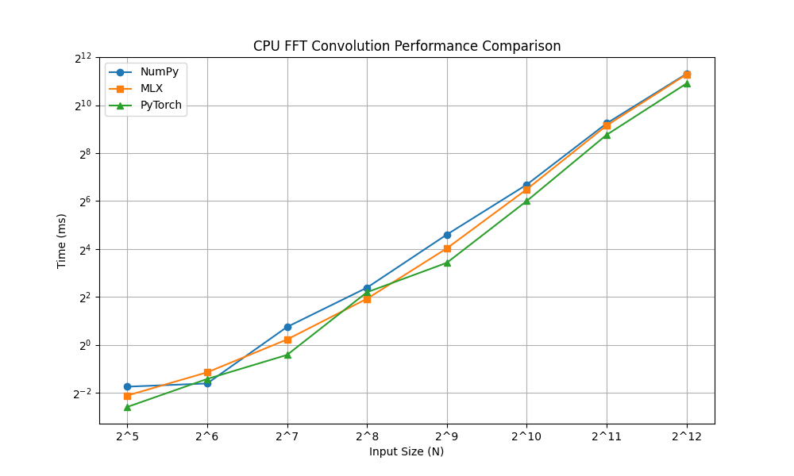
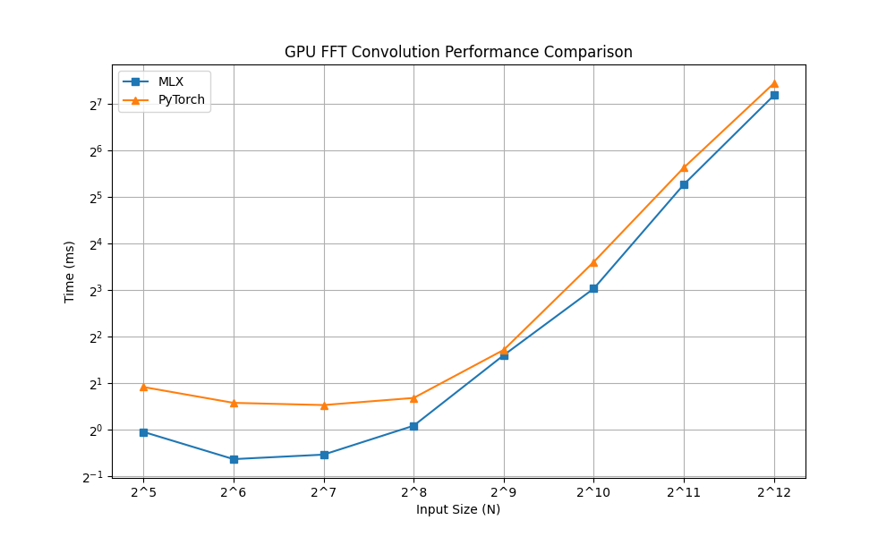

# Nd-Conv

For now, this is a performance benchmark of self-implemented fast fourier transform-based convolutions in np, mlx, and torch on Apple M2 Max hardware.

I was just a bit curious on fft convs and deep learning frameworks on Apple silicon... 

The next todo will be to write cnns in all three for mnist classification and see the performance there.

## Usage

On the command line, execute the following

1. cd src

2. bash script/run.sh

Here are some graphs:

## CPU Benchmark

## GPU Benchmark

## Takeaway

Seems like they are quite similar across frameworks. Is there something wrong with my implementations? I would expect for mlx vs torch mps on gpu, mlx would be much faster...Not sure. If you have any ideas, feel free to drop an issue. 

## Acknowledgement
I thank [laurent perrinet](https://laurentperrinet.github.io/sciblog/posts/2017-09-20-the-fastest-2d-convolution-in-the-world.html) for the nice blog and np fft convolution implementation (which I optimized over).
